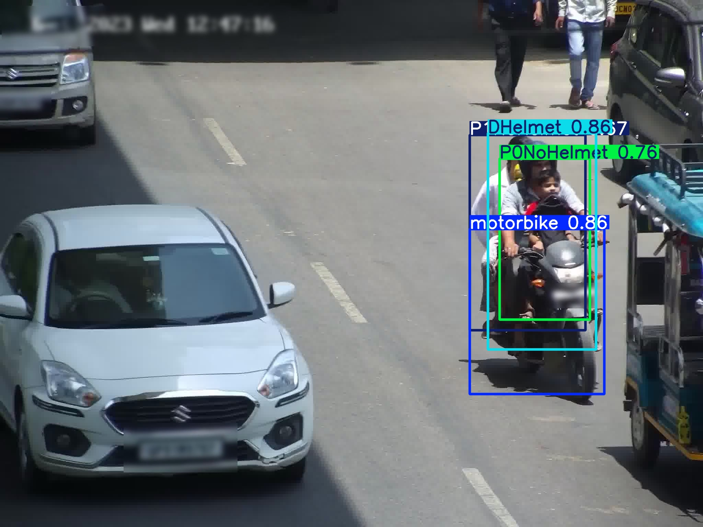
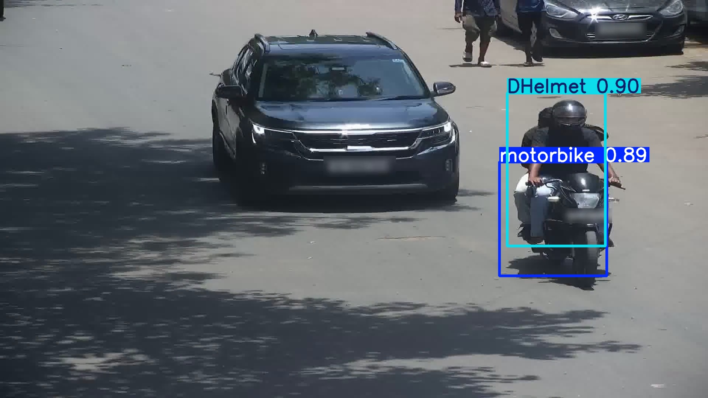

# 🪖 Helmet Violation Detection using YOLOv8

This project detects violations of helmet rules by motorcyclists using computer vision and deep learning. It leverages the YOLOv8 object detection model to identify motorcyclists and classify whether they are wearing helmets.

---

## 📌 Project Overview

Motorcycle riders are at high risk in road traffic, especially in developing countries. Wearing helmets is mandatory in many regions, but enforcement is difficult. This project aims to automatically detect riders and passengers who are not wearing helmets using video surveillance data.

---

## 🔧 Technologies Used

- Python 3.x
- [Ultralytics YOLOv8](https://docs.ultralytics.com/)
- OpenCV
- Matplotlib
- Spyder (IDE)
- GPU: Trained and tested on NVIDIA RTX 3050 Ti


---

## 🗂️ Project Structure

```
helmet_detection_project/
├── videos/                    # Original video files (not uploaded to GitHub)
├── frames/                    # Extracted frames from videos
├── yolo_dataset/
│   ├── images/train/          # Images in YOLO format
│   └── labels/train/          # Corresponding YOLO labels
├── results/                   # Output prediction examples (.jpg, .mp4)
├── report/                    # Evaluation metrics and training results
├── train_polo.py              # Model training script
├── video_predict.py           # Runs inference on video files
├── convert_to_yolo.py         # Converts gt_cleaned.txt to YOLO format
├── label_visualizer.py        # Draws bounding boxes for visual check
├── fast_test.py               # Runs inference on sample image
├── gt_cleaned.txt             # Cleaned ground truth (1–9 ➜ 0–8)
├── data.yaml                  # YOLOv8 training configuration
└── README.md                  # This file
```

---

## 🧠 Dataset

The dataset consists of 100 real-world traffic surveillance videos (20s each).  
Due to licensing restrictions, **the dataset and extracted frames are not included in this repository**.

- Annotation format:
  ```
  <video_id>, <frame>, <x>, <y>, <width>, <height>, <class_id>
  ```
- Class labels (after cleaning):
  ```
  0: motorbike
  1: DHelmet
  2: DNoHelmet
  3: P1Helmet
  4: P1NoHelmet
  5: P2Helmet
  6: P2NoHelmet
  7: P0Helmet
  8: P0NoHelmet
  ```

> 📦 **Dataset can be requested from the official challenge page:**  
> [https://www.aicitychallenge.org/2024-challenge-tracks/](https://www.aicitychallenge.org/2024-challenge-tracks/)

---

## 🏃‍♂️ How to Run

### 1. Install requirements
```
pip install ultralytics opencv-python matplotlib
```

### 2. Extract frames from videos
```
python process_videos.py
```

### 3. Clean and convert annotations
```
python clean_gt.py
python convert_to_yolo.py
```

### 4. Train the model
```
python train_polo.py
```

### 5. Run inference on images
```
python fast_test.py
```

### 6. Run inference on videos
```
python video_predict.py
```

---

## 🖼️ Example Predictions

Here are some sample outputs from the trained YOLOv8 model:

<p align="center">
  
</p>

<p align="center">
  
</p>

---

## 📈 Outputs

Trained model and logs are saved under:
```
runs/helmet-detection/
```

Evaluation files are stored under the `report/` folder:

- `report/results.png`: training curves  
- `report/results.csv`: contains mAP, precision, recall scores for each epoch  
- `report/confusion_matrix.png`: class-wise performance overview  
- `report/P_curve.png`, `report/R_curve.png`, `report/F1_curve.png`: class-wise precision-recall-f1 charts

---

## 📊 Evaluation Summary

- mAP@50: ~0.80  
- Precision: ~0.75  
- Recall: ~0.70  

The model was trained using YOLOv8 on a cleaned dataset of helmet usage in real traffic videos.  
It successfully detects both motorbike riders and their helmet status with high confidence.

---

## 🛑 License Notice

The dataset is licensed for academic and challenge use only under the original [DATASET LICENSE AGREEMENT](./DATASET%20LICENSE%20AGREEMENT.pdf).  
Therefore, the dataset is not included in this GitHub repository in accordance with the license terms.
Interested users may request access through the official competition website.


---

## 🧑‍💻 Author

- **Mehmet Çokol**  
  Eskişehir Teknik Üniversitesi  
  Computer Vision Challenge Track 5 – *Helmet Rule Violation Detection*

---
